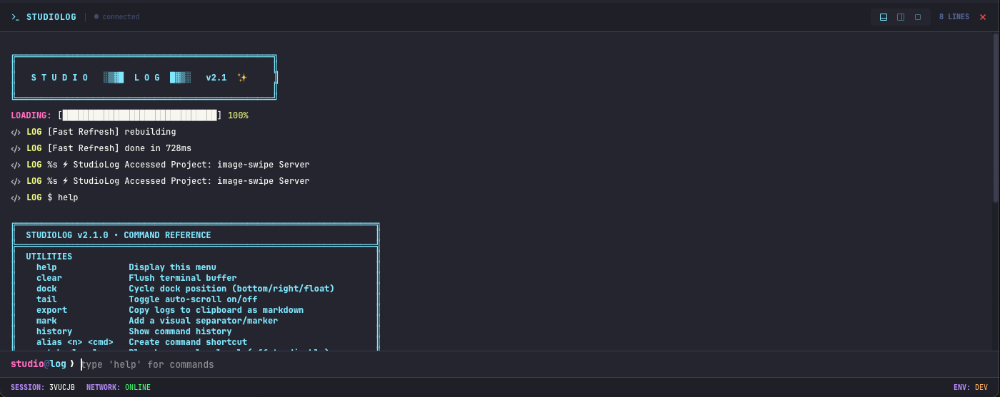

# StudioLog

**Premium in-app debug console for React applications.**

StudioLog is a beautiful, terminal-style debug console that lives inside your app. Perfect for Tauri applications, kiosk mode, or anywhere DevTools aren't available.



## Features

- **Resident Console** - Always available within your app window
- **Terminal Commands** - `filter`, `grep`, `export`, `theme`, and more
- **Multiple Themes** - Dracula, Nord, Matrix, Synthwave
- **Dock Modes** - Bottom, Right, or Floating window
- **Boot Animation** - Cool terminal-style startup sequence
- **Keyboard Shortcut** - Toggle with `Cmd+J` / `Ctrl+J`
- **Zero Network** - All data stays local, no telemetry
- **TypeScript** - Full type definitions included

## Installation

```bash
npm install studiolog
```

## Usage

```tsx
import { Peek } from 'studiolog'
import 'studiolog/styles.css'

export default function App({ children }) {
  return (
    <>
      {children}
      <Peek enabled={true} />
    </>
  )
}
```

## Commands

| Command | Description |
|---------|-------------|
| `help` | Show all commands |
| `clear` | Clear the console |
| `filter <level>` | Filter by log level (error, warn, info, log, debug) |
| `grep <term>` | Search logs containing term |
| `theme <name>` | Switch theme (dracula, nord, matrix, synthwave) |
| `dock` | Cycle dock position |
| `export` | Copy logs to clipboard as markdown |
| `info` | Show ASCII art system info |
| `status` | Show session health |
| `uptime` | Show session duration |
| `memory` | Show JS heap usage |
| `fps` | Show current frame rate |

## Themes

- **Dracula** (default) - Purple-tinted dark theme
- **Nord** - Cool, arctic color palette
- **Matrix** - Retro green-on-black
- **Synthwave** - Neon 80s aesthetic

## Props

| Prop | Type | Default | Description |
|------|------|---------|-------------|
| `enabled` | `boolean` | `true` | Enable/disable the console |

## Development

```bash
# Install dependencies
npm install

# Run tests
npm test

# Build for production
npm run build

# Watch mode
npm run dev
```

## License

MIT © Mio Kaza Labs
